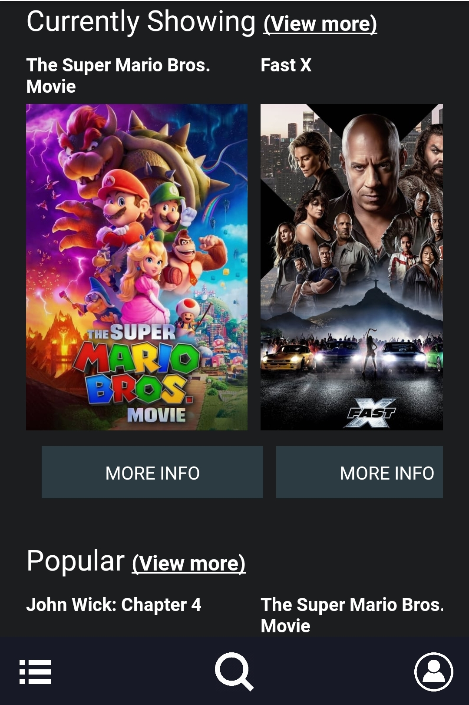
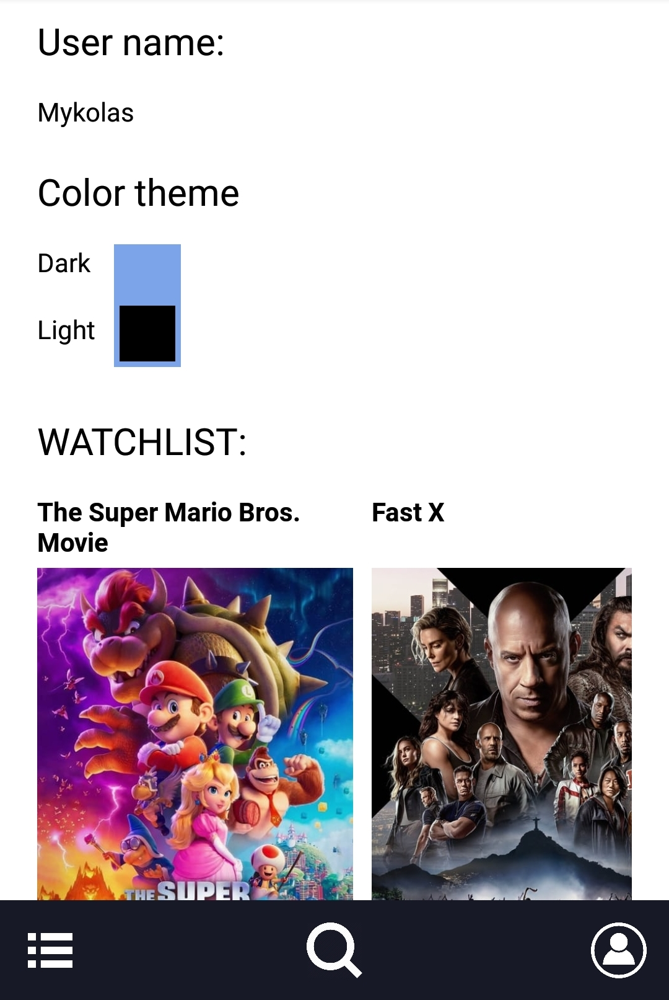
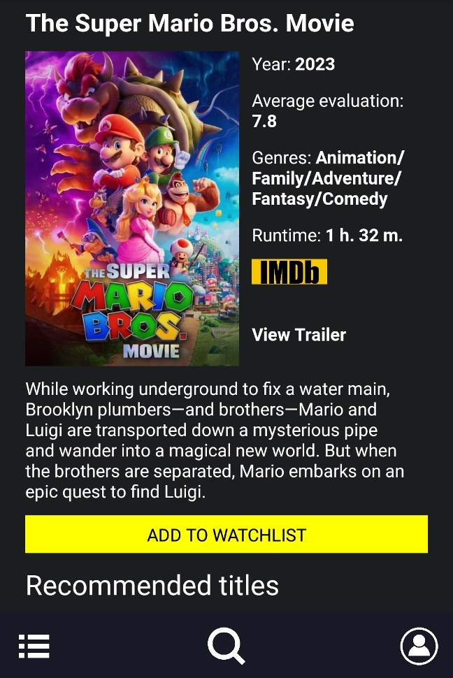

<h2>Description</h2>
A simple front-end Android app for films, made using React Native. Employs The Movie Database API.
<h2>Functionality</h2>
<ul>
    <li>Log in screen, where the user can choose his own username.</li>
    <li>Browse screen, where the user can see lists of newest, currently popular and highest-rated films.</li>
    <li>Separate screens for each of the above categories, with the ability to jump to the next page in the results.</li>
    <li>A detailed info page for each film that can be accessed from all category lists and serch results, which features:
        <ul>
            <li>Functionality for enlarging the poster for each film (when clicked on poster).</li>
            <li>Link to film trailer on youtube, which can be opened and played on a modal screen.</li>
            <li>Link to the film's IMDB page which opens either in the IMDB app or the device's browser.<li>
            <li>List of the film's genres.
            <li>Functionality for adding the film to the user's whatchlist and, when added, for removing it.</li>
            <li>List of recommended films based on the current film.</li>
            <li>Other info for the film.</li>
        </ul>
    </li>
    <li>A search screen, allowing the user to search the film by title or part of title and displaying results.</li>
    <li>A theme switching functionality with two themes, dark (default) and lite.</li>
    <li>Film watchlist.</li>
    <li>A profile page, whith the user's name, theme switcher and a list of films added to the watchlist and ability to remove them.</li>
    <li>A menu at the bottom of the screen, which allows the user to jump to the browse page, search page and his profile page.</li>
</ul>

<h2>Launch Instructions</h2>
<ol>
    <li>NOTE: you need to have <strong>NPM</strong> dependency manager and <strong>Node.js</strong> installed on your computer. If you do not have them, you can find instructions for downloading and installing them <a href="https://docs.npmjs.com/downloading-and-installing-node-js-and-npm" target = "_blank">here</a>. You will also need the Expo Go app on your Android device (can be downloaded from the Google Play app store).</li>
    <li>Download and extract the zip file or pull the repository from the GitHub.</li>
    <li>Run your CLI tool as Administrator, set the current directory to the project's main directory and run 'npm install' to auto-install required dependencies.</li>
    <li>Run npx expo start on your CLI.</li>
    <li>Open the Expo app on your phone and scan the QR code provided by the CLI. The application should load on your device.</li>
    <li>Use the user name of your choice and the password 'password' to log in.</li>
</ol>

Made by Mykolas Baranauskas. <a href="https://mykolasbar.github.io/my-website/" target="_blank">Website</a>, <a href="https://www.linkedin.com/in/mykolas-baranauskas-b3809b110/" target="_blank">LinkedIn</a>.